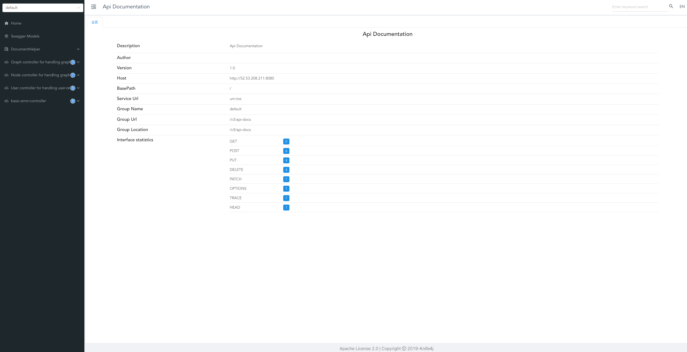

[//]: # (Copyright 2024 Paion Data)

[//]: # (Licensed under the Apache License, Version 2.0 &#40;the "License"&#41;;)
[//]: # (you may not use this file except in compliance with the License.)
[//]: # (You may obtain a copy of the License at)

[//]: # (    http://www.apache.org/licenses/LICENSE-2.0)

[//]: # (Unless required by applicable law or agreed to in writing, software)
[//]: # (distributed under the License is distributed on an "AS IS" BASIS,)
[//]: # (WITHOUT WARRANTIES OR CONDITIONS OF ANY KIND, either express or implied.)
[//]: # (See the License for the specific language governing permissions and)
[//]: # (limitations under the License.)

import Tabs from '@theme/Tabs';
import TabItem from '@theme/TabItem';

So You Want An API?
-------------------

:::info Please make sure JDK 17, Maven, and Docker Engine have been installed 🤗

- We offer [instruction](setup#installing-java--maven-on-mac) on how to install JDK 17 and Maven
- We also offer [links to Docker Engine installation](setup#installing-docker-engine)

:::

The easiest way to start with Aristotle is using its Docker:

```bash
git clone git@github.com:paion-data/aristotle.git
cd aristotle
mvn clean package
docker compose up --build --force-recreate
```

We can then access the API documentation at http://localhost:8080/doc.html on our local server:



Getting Started
---------------

### Creating New User

Creating a user is the first step for interacting with Aristotle API and requires 2 pieces of information:

1. an OIDC ID - [The `sub` field](https://connect2id.com/learn/openid-connect#claims) of the OAuth2 ID token in Open ID
   connect. Aristotle assumes a [separate OAuth2 authentication](https://openidconnect.net/) is already done for a user
   (see the _Tip_ below)
2. a username - The display name of the user. Can be arbitrary string

:::tip

API authentication is largely a solved problem and generally outside the scope of Aristotle. Authorization - the act of
verifying data and operation access for an already authenticated user in the Aristotle - is
[discussed in separately](authorization)

:::

We can now run the following curl commands to create a user for us. Don't forget to replace `localhost:8080` with the
actual location if it's not running locally.

<Tabs>
  <TabItem value="request" label="Request" default>
    ```json
    curl -X POST -H  "Accept:*/*" -H  "Content-Type:application/json" \
        -d "{\"oidcid\":\"google-oauth2|221814024135396311575\",\"username\":\"QubitPi\"}"
        "http://localhost:8080/user"
    ```
  </TabItem>
  <TabItem value="response" label="Response">
    ```json
    {
      "code": 200,
      "msg": "Created successfully.",
      "data": {
        "oidcid": "google-oauth2|221814024135396311575",
        "username": "QubitPi"
      }
    }
    ```
  </TabItem>
</Tabs>

In the example above, we created a user with OIDC ID `google-oauth2|221814024135396311575` and username `QubitPi`. Note
that we can also do so via Knife4J at http://localhost:8080/doc.html: 

import Knife4jCreatingUser from './img/knife4j-creating-a-user.png';

<div align="center"> 
    
</div>

If the graph database is Neo4J, we can now see the new node through its Neo4J Browser:

import Neo4jBrowserNewUser from './img/neo4j-browser-new-user.png';

<div align="center"> 
    
</div>

#### Creating The First Graph

TBA

#### Creating and Binding Nodes with Links

TBA
